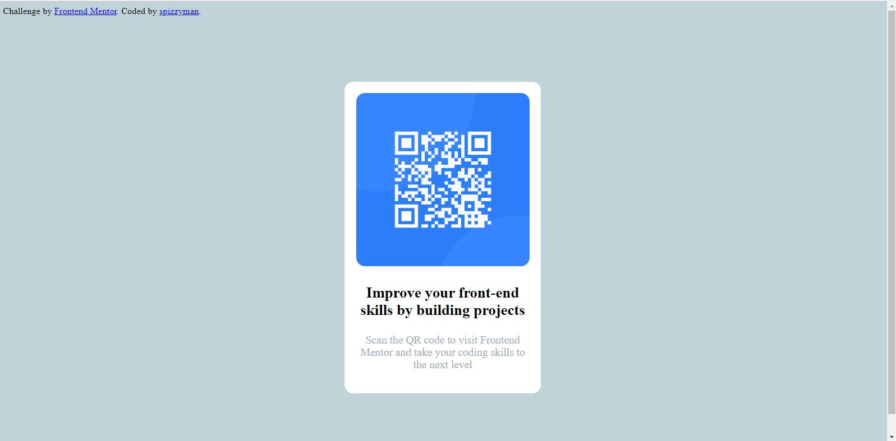

# Frontend Mentor - QR code component solution

This is a solution to the [QR code component challenge on Frontend Mentor](https://www.frontendmentor.io/challenges/qr-code-component-iux_sIO_H). Frontend Mentor challenges help you improve your coding skills by building realistic projects. 

## Table of contents

  - [Screenshot](#screenshot)
  - [Links](#links)
  - [My process](#my-process)
  - [Built with](#built-with)
  - [What I learned](#what-i-learned)
  - [Continued development](#continued-development)
  - [Author](#author)

### Screenshot



### Links

- Live Site URL: [Live site](https://spizzyman.github.io/frontendmentorsolution/)

## My process

Started with making an html file for the project. Created a css file afterwards and connected them, using the link attribute.

### Built with

- Semantic HTML5 markup
- CSS custom properties
- Flex

### What I learned

I learnt alot while doing this project. Ranging from div containers in my html, to media queries in my css.

```css
@media (max-width: 461px) {
  .container {
    padding-left: 80px;
    padding-right: 90px;
    margin-top: 170px;
  }
}
```

### Continued development

I want to keep focusing on perfecting my css, I am currently no where close to my dreams, but I know I would get there!

## Author

- Frontend Mentor - [spizzyman](https://www.frontendmentor.io/profile/spizzyman)
- Twitter - [spizzy.man](https://www.twitter.com/)
